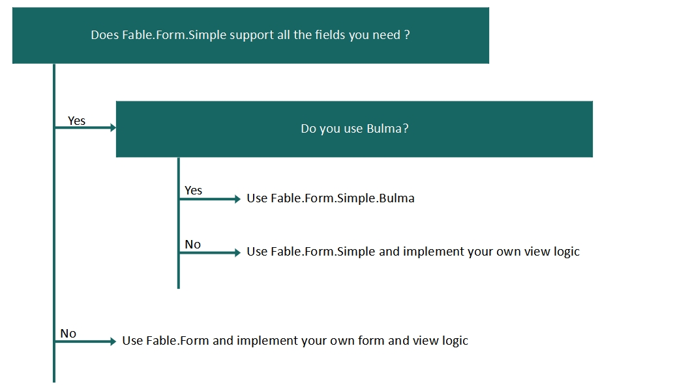

Fable.Form has been designed with modularity/customisation in mind.

It consist of 3 layers:

1. A **core** library defining the `Base` types and functions needed to represents / manipulate a form.library.

    This correspond to `Fable.Form`

2. A library, which implements how a form is represented, what fields are supported.

    This correspond to `Fable.Form.Simple`

3. A library, whichs implements how a form should be rendered `view`.

    This correspond to `Fable.Form.Simple.Bulma`

Only `Fable.Form` is mandatory, see below how to choose what you should use depending on your needs.

### What should I use?

*[Click here to see the list of supported field from Fable.Form.Simple](/Fable.Form/Fable.Form.Simple/features.html)*

 

